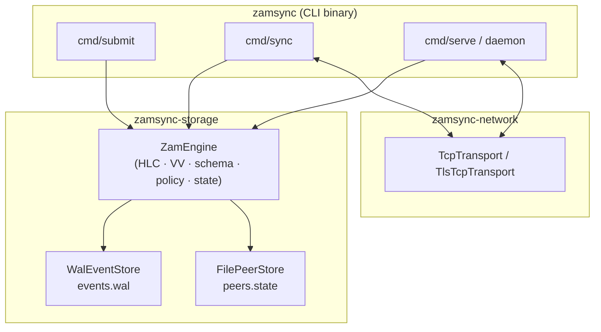
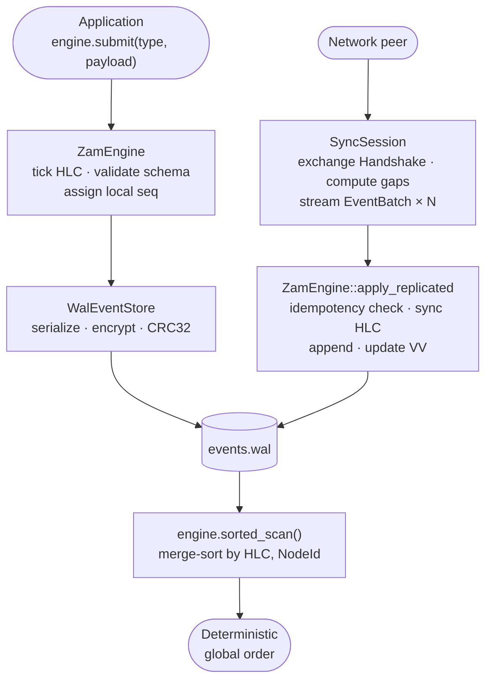
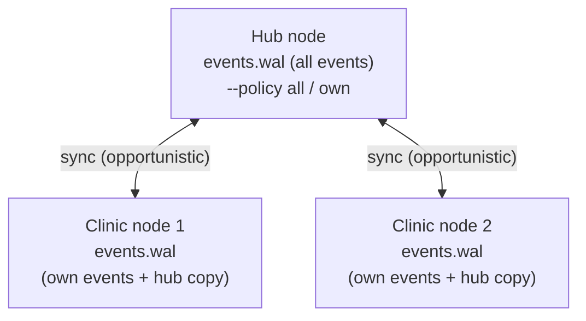

# Architecture Overview

ZamSync is an offline-first event-log replication engine. It is designed for deployments where nodes are frequently disconnected, bandwidth is metered, and data loss is unacceptable. A clinic device in a remote area, for example, must keep recording patient events while its satellite link is down, then converge with the central hub the next time a connection window opens.

This page explains how ZamSync's components fit together. The following pages go deeper into each subsystem:

- [Write-Ahead Log](wal.md) - durability, binary format, encryption, recovery
- [Hybrid Logical Clocks](hlc.md) - causally-correct timestamps across distributed clocks
- [Sync Protocol](sync-protocol.md) - version vectors, gap detection, message flow
- [Security](security.md) - mTLS transport, ChaCha20-Poly1305 at-rest, key management

---

## Design goals

| Goal | What it means in practice |
|------|--------------------------|
| Offline-first | Every node can write events without any network access. Replication is opportunistic. |
| Convergent | Any two nodes that sync will reach identical event sets regardless of sync order. |
| Auditable | Every event is immutable once written and carries a tamper-evident SHA-256 hash. |
| Bounded memory | The WAL grows on disk, not in RAM. Startup replays the WAL to rebuild state. |
| Metered-link friendly | A sync session can be capped by byte budget and resumed on the next connection window. |

---

## Component map

### Crates

| Crate | Responsibility |
|-------|---------------|
| `zamsync-core` | Pure domain types: `Event`, `Hlc`, `NodeId`, `VersionVector`, `SyncMessage`. No I/O. |
| `zamsync-storage` | WAL persistence, encryption, engine, sync session. All disk I/O lives here. |
| `zamsync-network` | TCP and TLS transports, PKI helpers. All network I/O lives here. |
| `zamsync` (bin) | CLI commands, color output, metrics, HTTP API. Thin glue layer. |

---

## Data flow: submit to projection

---

## Topology: hub and clinic

ZamSync does not enforce a fixed topology, but the typical deployment is hub-and-spoke:

With `--policy own`, the hub sends each clinic only the events that clinic originally submitted. With `--policy all` (the default), every node receives the full log.

---

## Files on disk

Every node stores two files in its data directory:

| File | Contents |
|------|----------|
| `events.wal` | Append-only binary log of all events, optionally encrypted. |
| `peers.state` | Serialized `ReplicationState`: local version vector and per-peer sync state. |
| `.node_id` | The node's 32-bit numeric identity, created automatically on first run. |
| `tls/` | Optional directory with CA cert, node cert, node key, and WAL key (created by `keygen`/`sign`). |

The WAL is the source of truth. On startup, `ZamEngine::new` replays the entire WAL to rebuild the version vector and application state. The `peers.state` file only stores what remote peers have confirmed; it is never trusted over the WAL for local event counts.
